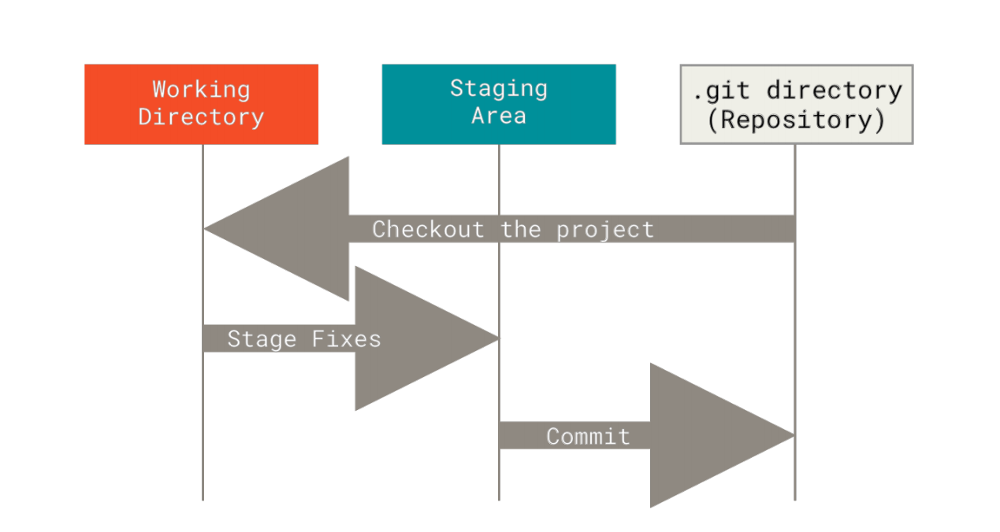
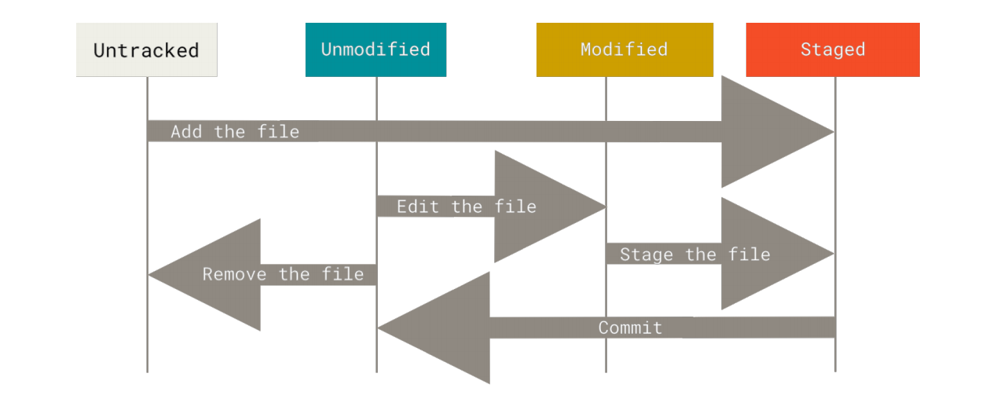

# git-usage

该项目用于记录 git 学习笔记，同时也用于测试 git 各种命令等。
项目地址：(https://github.com/Coley48/git-usage)
### 关于版本控制

> 版本控制是一种记录一个或若干文件内容变化，以便将来查阅特定版本修订情况的系统。通常，我们对保存着软件源代码的文件作版本控制，但实际上，你可以对任何类型的文件进行版本控制。Git 是基于差异（delta-based）的版本控制工具。
> 在 Git中，每当你提交更新或保存项目状态时，它基本上就会对当时的全部文件创建一个快照并保存这个快照的索引。为了效率，如果文件没有修改，Git 不再重新存储该文件，而是只保留一个链接指向之前存储的文件。Git 会为每个版本都创建一个快照。

<!-- more -->

### Git 工作方式

基本的 Git 工作流程如下：

1. 在工作区中修改文件。
2. 将你想要下次提交的更改选择性地暂存，这样只会将更改的部分添加到暂存区。
3. 提交更新，找到暂存区的文件，将快照永久性存储到 Git 目录。


文件的三种状态：已提交（committed）、已修改（modified） 和 已暂存（staged）。
- 已修改表示修改了文件，但还没保存到数据库中。
- 已暂存表示对一个已修改文件的当前版本做了标记，使之包含在下次提交的快照中。
- 已提交表示数据已经安全地保存在本地数据库中。

结合文件的三种状态，与之对应的有三个位置：工作区（workspace）、暂存区（index）、Git仓库（repository）；
- 工作区是对项目的某个版本独立提取出来的内容。 这些从 Git 仓库的压缩数据库中提取出来的文件，放在磁盘上供你使用或修改。
- 暂存区是一个文件，保存了下次将要提交的文件列表信息，一般在 Git 仓库目录中。 按照 Git 的术语叫做“索引”，不过一般说法还是叫“暂存区”。
- Git仓库是 Git 用来保存项目的元数据和对象数据库的地方。 这是 Git 中最重要的部分，从其它计算机克隆仓库时，复制的就是这里的数据。

Git 工作三个阶段:



Git 文件状态变更:



### Git 下载安装

Windows 上安装：

1. 从官网下载，[地址](https://git-scm.com/downloads)；
2. 执行安装程序，不更改默认选项，一路确认完成安装；
3. 安装完成后查看 Git 版本，`git --version` ；

[Linux、Mac 安装](https://git-scm.com/book/zh/v2/%E8%B5%B7%E6%AD%A5-%E5%AE%89%E8%A3%85-Git)

安装完成后使用`git --version`查看是否安装成功：
```bash
$ git --version # 输出当前 Git 版本信息
git version 2.29.2.windows.2
```

### Git 基本使用

#### 配置信息

`git config`命令用于查看或更改配置信息。安装完 Git 之后，要做的第一件事就是设置用户名和邮件地址。这一点很重要，因为每一个 Git 提交都会使用这些信息，它们会写入到你的每一次提交中，不可更改。该配置项会被写入用户文件夹下的.gitconfig 文件中。

```bash
$ git config --global user.name "username" # 设置用户名
$ git config --global user.email username@example.com # 设置邮箱地址
$ git config <key> # 显示指定配置项
$ git config --list # 显示所有配置信息
$ git config --list --show-origin # 显示配置信息及配置文件路径
$ git config --global core.editor "path/to/editor" # 配置默认的编辑器
$ git config --global core.editor notepad # 设置默认编辑器未notepad
$ git config --global alias.last 'log -1 HEAD' # 为 Git 命令创建自定义别名
```

#### 创建仓库

Git 创建仓库一般分为两种方式：

1. 在本地创建

`git init`命令将创建一个名为 .git 的子目录（隐藏文件夹），这个子目录包括初始化的 Git 仓库中所有的必须文件，这些文件是 Git 仓库的骨干。

```bash
$ cd /path/to/myProject # 进入到项目文件夹下
$ git init # 在本地创建 Git 仓库，将尚未进行版本控制的本地目录转换为 Git 仓库；
```

2. 从远程克隆

`git clone`命令将从远程 Git 服务器上将项目下载到本地，形成一个本地的克隆仓库，默认配置下远程 Git 仓库中的每一个文件的每一个版本都将被拉取下来。命令会自动将其添加为远程仓库并默认以 “origin” 为简写，克隆方式（git/https）也会绑定成为上传方式。

```bash
$ git clone https://github.com/User/Project.git # 使用http协议在当前文件夹下下载Project项目
$ git clone git@github.com:User/Project.git # 使用Git协议在当前文件夹下下载Project项目
$ git clone https://github.com/User/Project.git newName # 下载Project项目到newName文件夹中，也可以跟路径，下载到指定位置
$ git clone -b [branch] https://github.com/User/Project.git # 下载项目指定分支，并且绑定获取和推送地址为该分支；
$ git clone -o [remoteName] git@github.com:User/Project.git # 为远程分支设置名称
$ git clone --deepth -n [url] # 创建 n 层的浅拷贝
# 下载链接后的 .git 可以不加；
```

#### 修改提交

`git add`命令用于添加文件到缓冲区并跟踪文件，即监视文件变动。

```bash
$ git add [file] # 添加跟踪文件到暂存区
$ git add *.c # 添加所有.c文件
$ git add . # 添加所有文件
```

`git commit`命令用于将缓冲区中的文件提交到本地仓库。

```bash
$ git commit # 提交代码到本地仓库，默认使用 nano 编辑器，建议更改默认编辑器
$ git commit -m "comments" # 提交代码并添加注释
$ git commit -a # 跳过 git add 添加到缓冲区操作，直接提交已跟踪的更改文件
$ git commit -am "comments" # 直接提交更改文件，同时添加注释
$ git commit --amend # 重新提交，可以补充提交暂存区中的文件，也可以重写注释
```

`git mv`命令用于重命名已跟踪的文件。

```bash
$ git mv [fileA] [fileB] # 将文件 fileA 重命名为 fileB
```

`git cherry-pick`命令用于移植某些提交的变更。

```bash
$ git cherry-pick [hash | branch] # 将某次提交的变动转移到当前分支下
$ git cherry-pick --continue # 当移植过程中出现冲突时，需先解决冲突，然后执行该命令完成移植
$ git cherry-pick --abort # 放弃移植操作，回到操作前的状态
```

`git stash`命令用于保存和回复进度，方便中途切换分支。

```bash
$ git stash # 保存进度，将暂存区和工作区的改动保存起来
$ git stash pop # 恢复最新的进度到工作区
$ git stash drop # 丢弃最新的进度
$ git stash clear # 丢弃所有保存的进度
```

#### 远程操作

远程仓库是指托管在因特网或其他网络中的你的项目的版本库。
`git remote`命令用于查看、配置远程信息。

```bash
$ git remote # 用于显示远程配置信息，列出你指定的每一个远程服务器的简写，克隆仓库会显示origin，这是默认远程仓库的名称\
$ git remote -v # 显示需要读写远程仓库使用的 Git 保存的简写与其对应的 URL。
$ git remote add [remote] [url] # 添加一个新的远程 Git 仓库，同时指定一个方便使用的简写
$ git remote show [remote] # 显示指定远程仓库的信息
$ git remote set-url origin git@github.com:user/repo # 设置仓库上传地址，使用 git 协议，该设置存储在 .git/config 文件中
$ git remote set-url origin https://github.com/user/repo # 设置仓库上传代码地址，使用 https 协议
$ git remote add origin git@github.com:Coley48/webpack-code.git # 将本地仓库关联远程仓库
```

`git fetch`命令用于从远程仓库获取数据，该命令只会将数据下载到你的本地仓库——它并不会自动合并或修改你当前的工作，后续需要手动合并代码。

```bash
$ git fetch [remote] # 抓取指定远程仓库的代码，省略则抓取默认的 origin 远程仓库
```

`git push`命令用于将本地仓库的代码推送到远程仓库。需要有写入权限，并且本地代码已经更新到和远程仓库同步。

```bash
$ git push [remote] [branch] # 将代码推送到指定远程仓库的指定分支下，一般默认 origin 下的 master/main 主分支；
$ git push [remote] HEAD:[branch] # 使用该命令推送到指定的远程分支；
$ git push --set-upstream origin [branch] # 将本地分支推送到远程服务器，并创建对应的分支 
$ git push origin --delete [branch] # 删除远程分支
$ git push origin [branch] --force # 强制推送到远程，覆盖之前的提交版本
```

`git pull`操作用于从服务器拉取更新代码，并自动合并到本地。

```bash
$ git pull # 相当于 git fetch + git merge 结合的操作
$ git pull [remote] [branch] # 下载指定分支代码，并快速合并
```

#### 分支管理

`git branch`命令用于查看、创建分支等操作。

```bash
$ git branch # 查看工作区下的分支，并显示当前分支
$ git branch -a # 显示所有本地分支和远程分支
$ git branch -r # 显示远程分支
$ git branch -v # 显示分支的检验和以及上次提交注释信息
$ git branch -vv # 显示分支当前提交的信息以及跟踪的远程分支
$ git branch [branch] # 创建新的本地分支
$ git branch -d [branch] # 删除本地分支，未合并的分支会有错误提示
$ git branch -D [branch] # 强制删除本地分支
$ git branch --merged # 显示已合并的分支
$ git branch --no-merged # 显示未合并的分支
$ git branch --set-upstream-to=[remote/branch] [branch] # 跟踪远程分支
```

`git checkout`命令用于切换分支，切换分支体现在 .git/HEAD 文件中的指向；当从一个远程跟踪分支检出一个本地分支会自动创建一个叫做 “跟踪分支”，跟踪分支是与远程分支有直接关系的本地分支。

```bash
$ git checkout # 显示工作区、暂存区和远程仓库之间的差异
$ git checkout [branch | hash] # 切换到分支，可以切换到本地没有的分支，可以是历史提交的版本，或者远程分支，进入分离头模式（detached HEAD），在分离头模式中也可以创建新的分支；
$ git checkout -b [branch] # 创建并切换分支
$ git checkout -b [branch] [remote]/[branch] # 创建并跟踪本地分支
$ git checkout --track [remote]/[branch] # 创建并跟踪分支快捷方式
$ git checkout --orphan [branch] # 创建单独分支
```

`git merge`命令用于合并分支，该命令会形成一次合并提交。

```bash
$ git merge [hash | branch] # 合并某次提交或两个分支
$ git merge --abort # 终止并退出合并
```

`git rebase`命令用于分支变基，将提交到某一分支上的所有修改都移至另一分支上，然后切换到另一分支进行快速合并，实现的效果和 merge 相同效果；

```bash
$ git rebase [branch] # 将当前分支转接到目标分支后
```

#### 撤销删除

`git reset`用于撤销操作。

```bash
$ git reset HEAD [file] # 从暂存区取消指定暂存文件
$ git reset HEAD . # 从暂存区中取消所有暂存文件
$ git reset [file] # 从暂存区取消指定暂存文件
$ git reset -- [file] # 从暂存区取消指定暂存文件
$ git reset --hard [hash] # 撤销回退到某次提交状态，并删除代码，慎用
$ git reset --hard HEAD~n # 撤销之前的几次提交，并删除代码，HEAD~1 等价于 HEAD^，慎用
$ git reset --soft [hash] # 撤销回退到某次提交状态，不删除代码
$ git reset --soft HEAD~n # 撤销之前的几次提交，不删除代码
```

`git rm`命令用于删除 Git 项目中的文件。

```bash
$ git rm [file] # 从暂存区中删除文件，同时永久删除文件，不能删除未提交到仓库中的文件
$ git rm --cached [file] # 只从缓冲区中删除文件，取消跟踪
$ git rm -f [file] # 强制删除文件，包括未提交到仓库中的文件
$ git rm -rf . # 强制移除项目中所有文件
$ git rm -r --cached . # 删除本地缓存，有时更新.gitignore文件不会立即生效，可以执行该命令
```

`git restore`命令用于丢弃更改，但无法丢弃暂存区中文件更改。

```bash
$ git restore [file] # 忽略该文件的更改，退回到上次提交时的状态
$ git restore . # 忽略所有文件的更改
```

#### 标签管理

`git tag`命令用于为版本提交设置标签。Git 使用两种主要类型的标签：轻量标签（lightweight）与附注标签（annotated）。附注标签会包含作者、邮箱、日期等信息，轻量标签则没有保存任何其他信息。默认情况下，git push 命令并不会传送标签到远程仓库服务器上。 在创建完标签后你必须显式地推送标签到共享服务器上。

```bash
$ git tag # 显示标签，以字母顺序列出
$ git tag [tag] # 添加轻量标签；
$ git tag [tag] [hash] # 通过提交检验和加标签； 
$ git tag -a [tag] # 添加附注标签，并使用编辑器添加描述信息
$ git tag -a [tag] -m "comments" # 添加附注标签同时添加描述信息
$ git push origin [tag] # 上传标签到远程仓库
$ git push origin --tags # 上传所有标签到远程仓库
```

#### 信息显示

`git status`命令用于查看项目中文件状态，待提交、已修改、未跟踪等。

```bash
$ git status # 查看文件状态
$ git status -s/--short # 查看文件状态的简略信息，其中文件名前会显示两列标志，左栏表示暂存区的状态，右栏表示工作区的状态，?表示未跟踪，A表示新增，M表示修改过
$ git status -b/--branch # 显示分支信息
```

`git diff`命令用于查看文件更改前后之间的差异。

```bash
$ git diff [file] # 比较工作目录中当前文件和暂存区域快照之间的差异；
$ git diff --staged # 比对已暂存文件与最后一次提交的文件差异;
```

`git log`命令用于查看提交历史。

```bash
$ git log # 查看提交历史，包括检验和、作者、日期、注释等信息；
$ git log -p/--patch # 补丁格式显示，显示更改内容；
$ git log -n # 指定显示最后提交记录的条数；
$ git log --stat # 显示提交记录的同时，显示每次提交的简略统计信息；
$ git log --pretty=oneline # 指定显示格式，参数有 online | short | full | fuller，默认 full；
$ git log --abbrev-commit # 只显示检验和的前几位，一般7位
$ git log --oneline # --pretty=oneline 和 --abbrev-commit 组合的缩写
$ git log --oneline --decorate --graph --all # 显示提交历史、各个分支的指向以及项目的分支分叉情况
```

`git reflog`命令用于显示所有本地操作的历史记录，可用于恢复因误操作被删除的分支。

```bash
$ git reflog # 显示从仓库创建之后的所有操作
$ git reflog -n # 指定显示的条数
```

`git show`命令用于显示提交、分支、标签等详细信息。

```bash
$ git show # 显示上一次提交记录
$ git show  [hash | branch] # 显示该分支最后一次提交记录、作者、时间、文件差异等信息；
$ git show [tag] # 显示标签信息和提交信息；
```

`git help`命令可以查看 Git 指令的描述，以及详细用法；打开的是本地的英文文档网页文件，通常位于 Git 安装目录下的`Git/mingw64/share/doc/git-doc/`

```bash
$ git help [command] # 用浏览器打开该命令的详细说明页面
$ git [command] --help # 在指令后添加 --help 选项效果同 git help
```

#### 忽略文件

当项目中有一些缓存文件、日志文件、临时文件、测试文件等不需要跟踪的文件时，可以在项目根目录下新建一个`.gitignore`文件，将不需要跟踪的文件添加进去，Git 会忽略到这些文件。

`.gitignore`文件格式规范：

- 所有空行或者以 # 开头的行都会被 Git 忽略，注释。
- 可以使用标准的 glob 模式匹配，它会递归地应用在整个工作区中。
- 匹配模式可以以（/）开头防止递归。
- 匹配模式可以以（/）结尾指定目录。
- 要忽略指定模式以外的文件或目录，可以在模式前加上叹号（!）取反。

其中 glob 模式是指 shell 所使用的简化了的正则表达式。

- 星号（*）匹配零个或多个任意字符；
- [abc] 匹配任何一个列在方括号中的字符；
- 问号（?）只匹配一个任意字符；
- 如果在方括号中使用短划线分隔两个字符，表示匹配这两个字符范围内的字符；
- 使用两个星号（\*\*）表示匹配任意中间目录；

### 参考资料

- [Git 官网](https://git-scm.com/)
- [progit 在线文档](https://git-scm.com/book/zh/v2)
- [progit PDF电子书](https://github.com/progit/progit2-zh/releases/download/2.1.55/progit_v2.1.55.pdf)
- [Git 命令大全](https://www.jianshu.com/p/46ffff059092)
- [Git 奇淫技巧](https://github.com/521xueweihan/git-tips)
- [git-ssh 配置和使用](https://segmentfault.com/a/1190000002645623)
- [Github两种上传方式——SSH/https](https://blog.csdn.net/nbaDWde/article/details/80360836)
- [Git 撤销commit文件 和 回退push的文件](https://www.jianshu.com/p/491a14d414f6)
- [git使用情景2：commit之后，想撤销commit](https://blog.csdn.net/w958796636/article/details/53611133)
- [git reflog 后悔药操作](https://blog.csdn.net/Della0930/article/details/89487914)
- [git cherry-pick 教程](https://www.ruanyifeng.com/blog/2020/04/git-cherry-pick.html)
- [git本地分支和远程分支如何关联](https://blog.csdn.net/u012216131/article/details/84256384)
- [progit 当前进度](https://www.progit.cn/#_remote_branches)